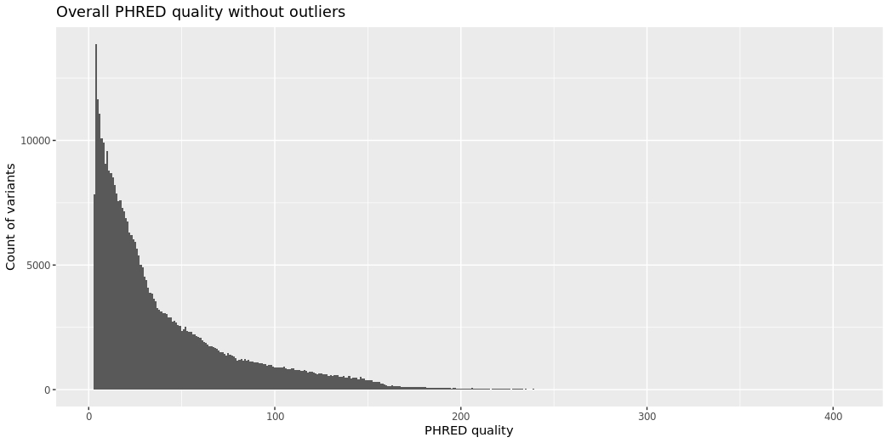
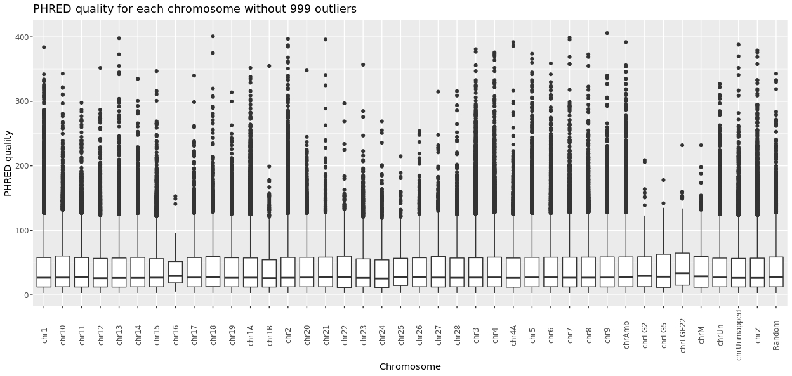
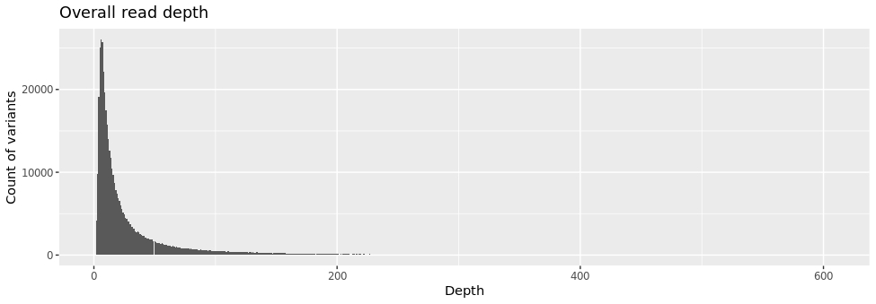
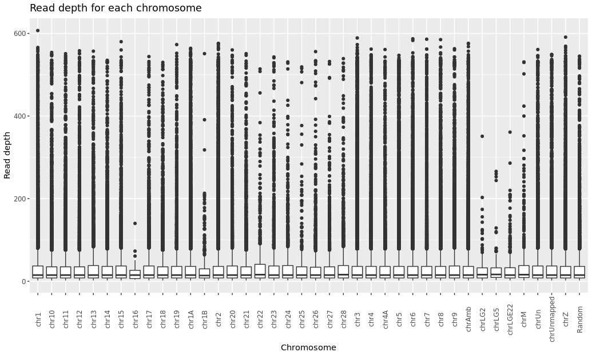
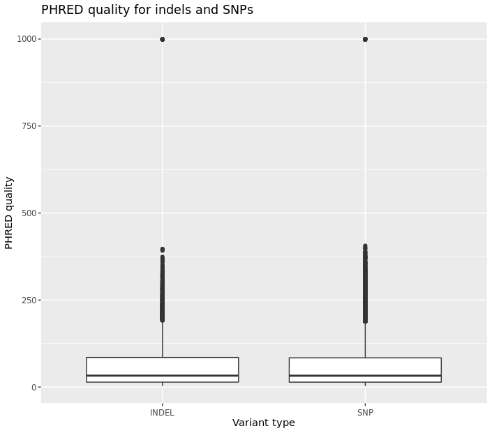
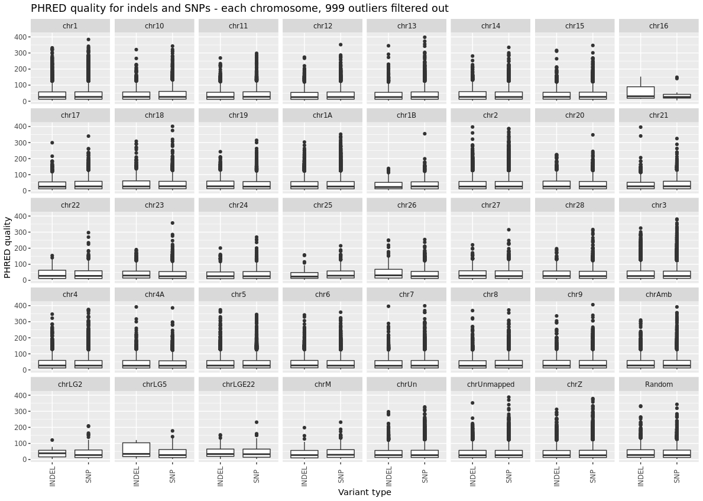
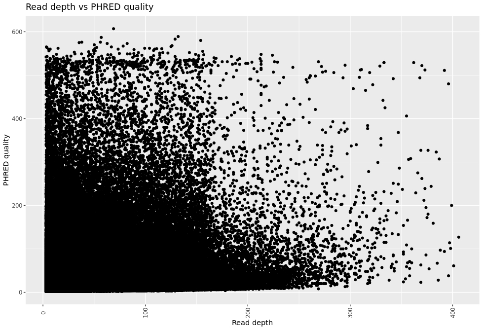

# Final task for the course Unix and NGS
This repository contains a solution to the final task in the course Unix and NGS data at the Faculty of Science, Charles University. The goal of the task is to process sample vcf data in Unix and R. The first part of the analysis contains processing of the sample vcf file /luscinia_vars.vcf.gz into the output file 02-data-with-DP-is-INDEL.tsv. The file contains information about genomic variants in the luscinia species, most notably the variables PHRED quality, read depth and allele frequency, which are used for subsequent analyses.
## Processing the data in Unix
First, we will create an executable script:
```
#!/bin/bash
```

To work with the data, we will create a folder called data and copy the data from the shared location.
```
cd final
mkdir data
cp /data-shared/vcf_examples/luscinia_vars.vcf.gz data/
```

Optionally, we can explore the file contents:
```
# Set up the INPUT file
# INPUT= /data/luscinia_vars.vcf

# Look at the data
# zcat <$INPUT | less -S
We unzip the file
# Unzip the file
gunzip data/luscinia_vars.vcf.gz

# Set up the INPUT file - unzipped
INPUT=data/luscinia_vars.vcf
```

Now we will selest the data that will be used for analysis in R. We will need the first columns in the vcf file as well as the read depth (DP) and allele frequency (AF1) columns which are stored in the INFO column. We will store the data in separate .tsv files which will then be merged using paste.
```
# Select the columns 1 to 6 from orig vcf file
<$INPUT grep -v '^##' | cut -f1-6  >data/01-data.tsv

# Create new columns containing DP, INDEL and AF1 from the column INFO
<$INPUT egrep -o 'DP=[^;]*' | sed 's/DP=//' > data/01-data-DP.tsv
<$INPUT awk '{if($0 ~ /INDEL/) print "INDEL"; else print "SNP"}' > data/01-data-is-INDEL.tsv
<$INPUT egrep -o 'AF1=[^;]*' | sed 's/AF1=//' > data/01-data-AF.tsv

# Create column names for the new columns
sed  -i '1i DP' data/01-data-DP.tsv
sed  -i '1i ISINDEL' data/01-data-is-INDEL.tsv
sed  -i '1i AF' data/01-data-AF.tsv

# Paste all columns to the final data file
paste data/01-data.tsv data/01-data-DP.tsv data/01-data-is-INDEL.tsv data/01-data-AF.tsv >data/02-data-with-DP-is-INDEL.tsv
```

## Processing the data in R
After creating the final .tsv file, we will load it into R to obtain nice plots using ggplot2.

```
# Read data
setwd("~/projects/final/")
final_data <- read_tsv('data/02-data-with-DP-is-INDEL.tsv', col_names=T) 
colnames(final_data)

#Change first colname from #CHROM to CHROM
colnames(final_data)[1] <- "CHROM"
head(final_data)
```

### Task 1. Distribution of PHRED qualities over the whole genome and by chromosome.
#### Over the whole genome
Histogram of PHRED qualities across the whole genome. We can see that many qualities have similar value 999. I don't know what does it mean (maybe NAs?), therefore, I filtered the 999 values out. However, the R script contains also the code for obtaining graph with non-filtered values.

```
# With filtered outliers
  final_data %>% 
    filter(QUAL < 999) %>% 
    ggplot(aes(QUAL)) +
    geom_histogram(binwidth=1) +
    # facet_wrap(~CHROM, ncol = 1) +
    ggtitle("Overall PHRED quality without outliers") +
    ylab("Count of variants") +
    xlab("PHRED quality")
```


#### Separated by chromosome
Again, I am showing filtered values. We can use for example the boxplot:

```
final_data_2 %>% 
  filter(QUAL < 999) %>% 
  ggplot(aes(factor(CHROM_recode), QUAL)) + 
  geom_boxplot() + 
  theme(axis.text.x = element_text(angle = 90, hjust = 0.5, vjust = 0.5)) +
  ggtitle("PHRED quality for each chromosome without 999 outliers") +
  ylab("PHRED quality") +
  xlab("Chromosome")
```


### Task 2. Distribution of read depth (DP) over the whole genome and by chromosome
#### Over the whole genome
Histogram of read depth across the whole genome. 

```
ggplot(final_data, aes(DP)) +
  geom_histogram(binwidth=1) +
  ggtitle("Overall read depth") +
  ylab("Count of variants") +
  xlab("Depth")
```


#### Separated by chromosome
```
final_data_2 %>% 
  filter(!is.na(DP)) %>% 
  ggplot(aes(factor(CHROM_recode), DP)) + 
  geom_boxplot() + 
  theme(axis.text.x = element_text(angle = 90, hjust = 0.5, vjust = 0.5)) +
  ggtitle("Read depth for each chromosome") +
  ylab("Read depth") +
  xlab("Chromosome")
```


### Task 3. Distribution of PHRED qualities INDELS vs. SNPs
#### Over the whole genome
Boxplot of read depth across the whole genome. 

```
final_data_2 %>% 
  filter(!is.na(QUAL)) %>% 
  ggplot(aes(factor(ISINDEL), QUAL)) + 
  geom_boxplot() + 
  theme(axis.text.x = element_text(hjust = 0.5, vjust = 0.5)) +
  ggtitle("PHRED quality for indels and SNPs") +
  ylab("PHRED quality") +
  xlab("Variant type")
```


#### Separated by chromosome
```
final_data_2 %>% 
  filter(!is.na(QUAL) & QUAL < 999) %>% 
  ggplot(aes(factor(ISINDEL), QUAL)) + 
  facet_wrap(~CHROM_recode, ncol = 8) +
  geom_boxplot() + 
  theme(axis.text.x = element_text(angle = 90, hjust = 0.5, vjust = 0.5)) +
  ggtitle("PHRED quality for indels and SNPs - each chromosome, 999 outliers filtered out") +
  ylab("PHRED quality") +
  xlab("Variant type")
```



### Task 9. Correlation between PHRED and DP
The non-parametric Spearman correlation test from the stats package shows that there is a statistically significant positive correlation between quality and read depth.

```
Spearman's rank correlation rho

data:  final_data_2$QUAL and final_data_2$DP
S = 1.1033e+16, p-value < 2.2e-16
alternative hypothesis: true rho is not equal to 0
sample estimates:
      rho 
0.2935605 
```
And the plot of the results:

